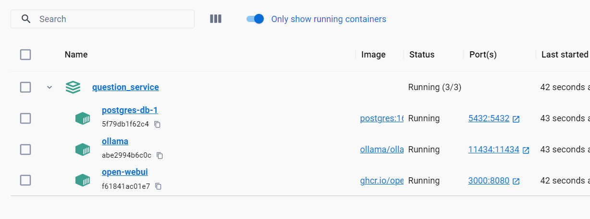
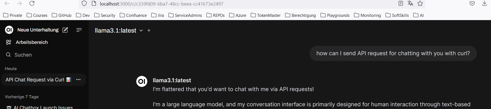

# Getting Started

### Used technologies

* Java Virtual Threads (Java 21)
* Docker
* PostgreSQL
* OpenAI


### SetUp

* Clone the repository
* Run docker compose
* Set the env variables in your IDE (OpenAI API key)
* Import the Postman collection in the project
* Run the project

### Docker Compose

In Docker compose file, you will find the following services:
1-PostgreSQL DB
2-Ollama
3-Open WebUI

Ollama helps running with large language models.
With Ollama we can run the following commands:
By this way Ollama service will start and run the command llama3 LLM model. 
This model will give us the answers for chat service.  
After starting all the services in docker-compose, we should execute following command:
```shell
docker exec -it ollama ollama run llama3
```



Open WebUI for chat:
We mus first Register and then Login to the chat service.
Localhost icin de registration yapilmali


### Reference Documentation
For further reference, please consider the following sections:

* [Official Apache Maven documentation](https://maven.apache.org/guides/index.html)
* [Spring Boot Maven Plugin Reference Guide](https://docs.spring.io/spring-boot/docs/3.2.5/maven-plugin/reference/html/)
* [Create an OCI image](https://docs.spring.io/spring-boot/docs/3.2.5/maven-plugin/reference/html/#build-image)
* [Spring Web](https://docs.spring.io/spring-boot/docs/3.2.5/reference/htmlsingle/index.html#web)
* [JDBC API](https://docs.spring.io/spring-boot/docs/3.2.5/reference/htmlsingle/index.html#data.sql)
* [Spring Boot Actuator](https://docs.spring.io/spring-boot/docs/3.2.5/reference/htmlsingle/index.html#actuator)
* [Spring Boot DevTools](https://docs.spring.io/spring-boot/docs/3.2.5/reference/htmlsingle/index.html#using.devtools)

### Guides
The following guides illustrate how to use some features concretely:

* [Building a RESTful Web Service](https://spring.io/guides/gs/rest-service/)
* [Serving Web Content with Spring MVC](https://spring.io/guides/gs/serving-web-content/)
* [Building REST services with Spring](https://spring.io/guides/tutorials/rest/)
* [Accessing Relational Data using JDBC with Spring](https://spring.io/guides/gs/relational-data-access/)
* [Managing Transactions](https://spring.io/guides/gs/managing-transactions/)
* [Building a RESTful Web Service with Spring Boot Actuator](https://spring.io/guides/gs/actuator-service/)

